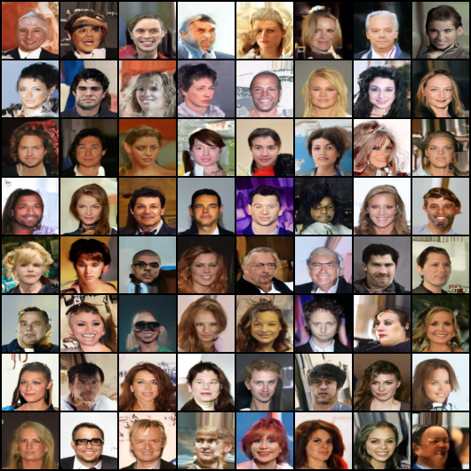

</img>

## Denoising Diffusion Probabilistic Model, in Pytorch

Implementation of <a href="https://arxiv.org/abs/2006.11239">Denoising Diffusion Probabilistic Model</a> in Pytorch. It is a new approach to generative modeling that may <a href="https://ajolicoeur.wordpress.com/the-new-contender-to-gans-score-matching-with-langevin-sampling/">have the potential</a> to rival GANs. It uses denoising score matching to estimate the gradient of the data distribution, followed by Langevin sampling to sample from the true distribution.

This implementation was inspired by the official Tensorflow version <a href="https://github.com/hojonathanho/diffusion">here</a>

Youtube AI Educators - <a href="https://www.youtube.com/watch?v=W-O7AZNzbzQ">Yannic Kilcher</a> | <a href="https://www.youtube.com/watch?v=344w5h24-h8">AI Coffeebreak with Letitia</a> | <a href="https://www.youtube.com/watch?v=HoKDTa5jHvg">Outlier</a>

<a href="https://github.com/yiyixuxu/denoising-diffusion-flax">Flax implementation</a> from <a href="https://github.com/yiyixuxu">YiYi Xu</a>

<a href="https://huggingface.co/blog/annotated-diffusion">Annotated code</a> by Research Scientists / Engineers from <a href="https://huggingface.co/">🤗 Huggingface</a>

Update: Turns out none of the technicalities really matters at all | <a href="https://arxiv.org/abs/2208.09392">"Cold Diffusion" paper</a> | <a href="https://muse-model.github.io/">Muse</a>


[](https://badge.fury.io/py/denoising-diffusion-pytorch)

## Install

```bash
$ pip install denoising_diffusion_pytorch
```

## Usage

```python
import torch
from denoising_diffusion_pytorch import Unet, GaussianDiffusion

model = Unet(
    dim = 64,
    dim_mults = (1, 2, 4, 8),
    flash_attn = True
)

diffusion = GaussianDiffusion(
    model,
    image_size = 128,
    timesteps = 1000    # number of steps
)

training_images = torch.rand(8, 3, 128, 128) # images are normalized from 0 to 1
loss = diffusion(training_images)
loss.backward()

# after a lot of training

sampled_images = diffusion.sample(batch_size = 4)
sampled_images.shape # (4, 3, 128, 128)
```

Or, if you simply want to pass in a folder name and the desired image dimensions, you can use the `Trainer` class to easily train a model.

```python
from denoising_diffusion_pytorch import Unet, GaussianDiffusion, Trainer

model = Unet(
    dim = 64,
    dim_mults = (1, 2, 4, 8),
    flash_attn = True
)

diffusion = GaussianDiffusion(
    model,
    image_size = 128,
    timesteps = 1000,           # number of steps
    sampling_timesteps = 250    # number of sampling timesteps (using ddim for faster inference [see citation for ddim paper])
)

trainer = Trainer(
    diffusion,
    'path/to/your/images',
    train_batch_size = 32,
    train_lr = 8e-5,
    train_num_steps = 700000,         # total training steps
    gradient_accumulate_every = 2,    # gradient accumulation steps
    ema_decay = 0.995,                # exponential moving average decay
    amp = True,                       # turn on mixed precision
    calculate_fid = True              # whether to calculate fid during training
)

trainer.train()
```

Samples and model checkpoints will be logged to `./results` periodically

## Multi-GPU Training

The `Trainer` class is now equipped with <a href="https://huggingface.co/docs/accelerate/accelerator">🤗 Accelerator</a>. You can easily do multi-gpu training in two steps using their `accelerate` CLI

At the project root directory, where the training script is, run

```python
$ accelerate config
```

Then, in the same directory

```python
$ accelerate launch train.py
```

## Miscellaneous

### 1D Sequence

By popular request, a 1D Unet + Gaussian Diffusion implementation.

```python
import torch
from denoising_diffusion_pytorch import Unet1D, GaussianDiffusion1D, Trainer1D, Dataset1D

model = Unet1D(
    dim = 64,
    dim_mults = (1, 2, 4, 8),
    channels = 32
)

diffusion = GaussianDiffusion1D(
    model,
    seq_length = 128,
    timesteps = 1000,
    objective = 'pred_v'
)

training_seq = torch.rand(64, 32, 128) # features are normalized from 0 to 1

loss = diffusion(training_seq)
loss.backward()

# Or using trainer

dataset = Dataset1D(training_seq)  # this is just an example, but you can formulate your own Dataset and pass it into the `Trainer1D` below

trainer = Trainer1D(
    diffusion,
    dataset = dataset,
    train_batch_size = 32,
    train_lr = 8e-5,
    train_num_steps = 700000,         # total training steps
    gradient_accumulate_every = 2,    # gradient accumulation steps
    ema_decay = 0.995,                # exponential moving average decay
    amp = True,                       # turn on mixed precision
)
trainer.train()

# after a lot of training

sampled_seq = diffusion.sample(batch_size = 4)
sampled_seq.shape # (4, 32, 128)

```

`Trainer1D` does not evaluate the generated samples in any way since the type of data is not known.

You could consider adding a suitable metric to the training loop yourself after doing an editable install of this package
`pip install -e .`.

## Result
* dataset: celeba
* GaussianDiffusion
    * image_size: 64
    * timesteps: 1000
    * sampling_timestep: 500 (ddim)
        * ddpm의 2배 속도로 accelerate했다는 의미
    * beta_schedule: linear (default = sigmoid)
* Trainer
    * train_batch_size: 32
    * train_lr: 0.004
    * train_num_steps: 100K
    * gradient_accumulate_every: 2 (사실상 batch_size = 64를 simulation)
    * ema_decay: 0.995
    * num_fid_samples: 320

실험 파일은 <code>'./ddpm_trainsample_exp.py'</code>에 있습니다.
